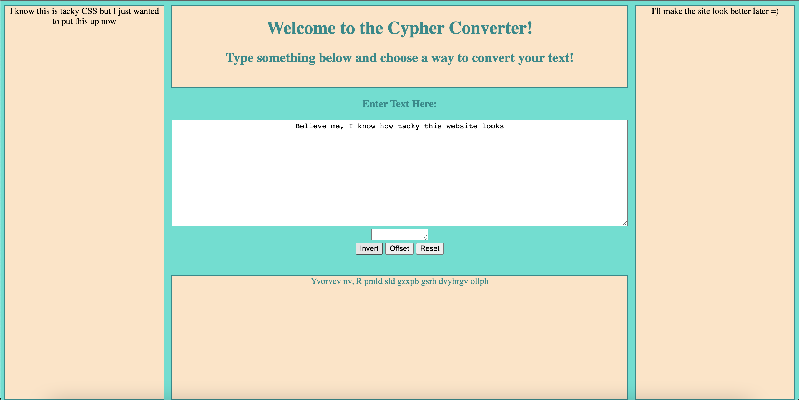
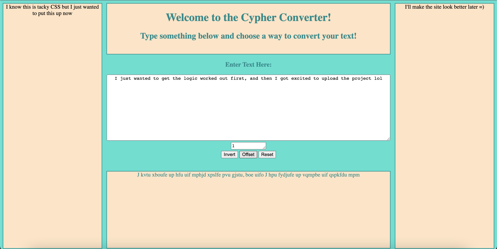

# CypherWebsite
<h1>Like my C++ Cypher Project but now for a website! (UNFINISHED)</h1>

<h2>How things are going so far:</h2>

- When you press the invert button

  

- When you press the offset button

  

